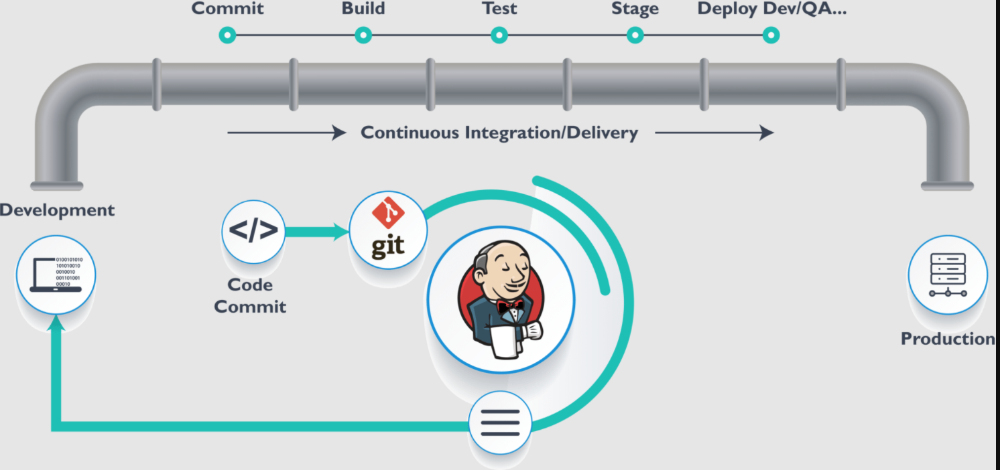

# DevOps-CI-CD-Pipeline-with-Jenkins-Kubernetes-GitHub-



>“DevOps is a must for all kinds of tech startups, small or big. It may be complex to start with but will make your life hell easy going forward and can save loads of time and energy for the organization to scale, scale and scale..”

[Referance(https://medium.com/the-programmer/ci-cd-pipeline-with-jenkins-github-part-1-c057a31b5297)]

***

Prerequisite Steps:

* [Install minikube](https://minikube.sigs.k8s.io/docs/start/)
* [Install docker desktop](https://docs.docker.com/desktop/mac/install/)
* [Create GitHub](https://github.com/)


1. **Start Minikube Cluster**

Jenkins oldukca hassas olgundan oturu, burada bellegimizi 4 GB olarak deklare edelim. Bunu da Minikube cluster'i baslatarak ektra fir flag ile yapabiliriz.

`$ minikube start - memory 4028`


Eger her sey nasarili bir sekilde yolunda gittiyse, tet edelim:

```cicdmodel
$ minikube status

minikube
type: Control Plane
host: Running
kubelet: Running
apiserver: Running
kubeconfig: Configured
```

2. **Clone the Sample repo:**

```cicdmodel
$ git clone https://github.com/eazyfin-pramod/fleetman-api-gateway.git

Cloning into 'fleetman-api-gateway'...
remote: Enumerating objects: 102, done.
remote: Counting objects: 100% (4/4), done.
remote: Compressing objects: 100% (4/4), done.
remote: Total 102 (delta 0), reused 0 (delta 0), pack-reused 98
Receiving objects: 100% (102/102), 20.58 KiB | 270.00 KiB/s, done.
Resolving deltas: 100% (35/35), done.
```

3. **jenkins dosyamizin icine girip Jenkins'in Docker imajini olusturacagiz**


4. **Build Jenkins docker Image**

Dockerfile'i kullanarak jenkins docker imaji olusturacagiz. Bunun icin `docker build image` komutunu kullanacagiz fakat bundan once calisma ortamimizi degistirip, local docker-deamon service'ini minikube cluster'in icinde calistiracagiz.

```cmd
$ minikube docker-env
$ eval $(minikube -p minikube docker-env)
```


Docker-deamon'in calistigindan emin olduktan sonra, docker imaj'imizi olusturabiliriz.

`$ docker image build -t myjenkins .`


Agir bir surec oldugundan sure uzun olabilir ancak asagidaki mesaji aldiginiz takdirde her sey yolunda demektir

- "Successfully built <imaj ID'si>"
- "Successfully tagged myjenkins:latest"


5. **Deploy Jenkins Image**

jenkins.yaml dosyasinin oldugu directory'de oldigimuzu varsayarsak, Jenkins deployment dosyasini olusturmak icin:

`$ kubectl apply -f jenkins.yaml`


6. **Check If Jenkins image is deployed**

`$ kubectl get all`

Gorebileceklerimiz:

- pod: ***jenkins-79966d8db-x4kn7*** 'nin deploy edildigi ve ***jenkins***
- ***service/jenkins*** 'in NodePort 31432'de calistigi
- Deployment: ***deployment.apps/jenkins*** 'in NodePort 31000'de calistigi


7. **Running the Jenkins in Your Web**

Eger her sey hatasiz bir sekilde kurulduysa, asagidaki komutu yazalim. Boylelikle minikube cluster'in local IP'sini alacagiz ve Jenkins UI calistirip web de calisip calismadigini gorecegiz.

```cmd
$ minikube ip

192.168.49.2
```  
Benim degerim bu sekilde. URL'i acip 192.168.49.2:31000 yazarsak, asgidaki sayfayi gormus oluruz.

`$ minikube service jenkins` de sayfayi acacaktir.
